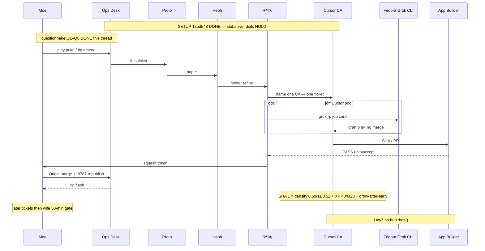

# Home Arcade — BH knob session (2026-09-07)

**Thread:** Grok co-pilot + Harper / Benjamin / Lucas  
**Human:** moe (Martin Moe Mühmer / MrxMoex)  
**When:** Monday 2026-09-07, ~18:49–19:25 CEST  
**SoT code:** Origin `mrxmoex/home-arcade`  
**Mint / paper:** `mrxmoex/home-arcade-grok`  
**CAPITOL:** `~/src/wip/private/wife-home-gamebase/`  
**Play tip floor (setup):** `18bd548` / knob stubs `74cf37c` / P0a tip `fce60f3`  
**Law:** Law7 (no per-child hub `:has()`) · unit ≠ accept · 1 ticket = 1 PR = 1 SHA · no STORED as shipped · dials HOLD until named CA

This file is the session paper: access preface, Q1–Q8 with thinking trails, final knob table, SHA slice, sidequests 2–6, honesty audit, pipeline, CLI cards, wife hook. **No code.**

---

## 0. How we got here

1. moe pointed Grok at Cursor Origin `https://cursor.com/codebase/mrxmoex/home-arcade/tree/main`. Auth wall. Files not visible from this seat.
2. moe: “Cant blame a sucker for trying😅 Want to get you busy, grokbots hav been working hard alone.”
3. Strategy note (moe): do **not** fold Grok-app traffic into the Cursor training sphere yet. Cursor agents already run full Grok. Wait for the **4.7** harness shift.
4. Working repo became the public mint `https://github.com/mrxmoex/home-arcade-grok` (README + `docs/` only). Stubs live on Origin; this thread is paper + dial questionnaire.

**Thinking trail:** Origin unread ≠ “no codebase.” Mint docs + knob board + catalog + fantasy tickets were enough to name HAVE knobs without inventing systems.

---

## 1. Co-pilot protocol (moe)

Ask **one question at a time**. After each answer, restate the implied knob table (name → HAVE vs suggested). Stop when the sheet is enough for a thin coding SHA.

Order: phone density → skillup cadence → tiny/tear → vacuum → asset→score → level packs → Arena → wife 30-min hook.

Rules: no code · no features outside knobs/packs/assets · German or English, match moe.

Context moe gave: stubs exist (`assetScoreMap`, `LevelPack`, pressure-fade named exports). Feel dials **not** turned yet.

---

## 2. Q1–Q8 (answer + trail + delta)

### Q1 — Phone density feel after P0a

**Ask:** too empty / ok / still crowded  
**moe:** “Still crowded + random spawns”

**Trail:** “Random” is not a spawn-director. Knob board has no jitter/cluster HAVE. Closest live path is `spawnCurveId=survivor` + `LEVEL_TUNE.orbTarget` + `MODE_DIFFICULTY` + `PRESSURE_CAP=104`. Honesty list already forbids selling hole-vs-hole spawn. Treat as **count** first (`DENSITY_MUL` / `FLOOR`), size second (`LARGE_MUL`). Classic phone is already thinner (0.64 / 12 / 0.48) — go a bit under classic.

| Knob | HAVE | Suggested |
|---|---|---|
| `SURVIVOR_PHONE_DENSITY_MUL` | 0.72 | **0.60** |
| `SURVIVOR_PHONE_DENSITY_FLOOR` | 14 | **11** |
| `SURVIVOR_PHONE_LARGE_MUL` | 0.58 | **0.52** |
| `SURVIVOR_PHONE_VIEW_SOFT` | 480 | hold |
| spawn jitter | *none* | **no new RNG** |

---

### Q2 — Skillup cadence

**Ask:** still too fast on long runs? early vs late  
**moe:** “Both Too fast, no progressive skillups metric -always twenty spams the screen”

**Trail:** Late floor `XP_PER_LEVEL=20` is *faster* than early `40`. That inverts normal climb and fires the skill-pick overlay constantly. “No progressive metric” ≠ new HUD. `xpToNextLevel` already exists — use it so cost grows after early. Do not invent a skillup meter. Hold `EARLY_PICK_WINDOW=3` / `DISTINCT_CAP=2` (spam is cadence, not choice count).

| Knob | HAVE | Suggested |
|---|---|---|
| `XP_PER_LEVEL` | 20 | **40** |
| `EARLY_XP_PER_LEVEL` | 40 | **60** |
| `EARLY_LEVEL_UPS` | 5 | **8** |
| `xpToNextLevel` | flat 20 after early | **grow after early** |
| pick window / distinct cap | 3 / 2 | hold |

---

### Q3 — Tiny threats

**Ask:** absorb/loot readable? tear chip fair?  
**moe:**  
1. “Enemy classification unclear -some smaler enemies just dont get absorbed”  
2. “Tear has no visible feedback, unclear when it happens”

**Trail:** Not “too mean / too soft.” Identity + FX gap. Small neutron can look eatable and still bounce (`massWeight` 1.55 + muddy silhouette). Tear chip amounts HOLD until a hit is visible. Raise **existing** collision blink/punch/sfx — board forbids a new VFX system. Class readability is **asset**, not a number this SHA.

| Knob | HAVE | Suggested |
|---|---|---|
| tiny-tier absorb | P0a live | **loosen** (small-looking food must eat) |
| `TEAR_*` / `CORE_*` chip | live | **hold** |
| tear / collision FX | invisible | **raise existing sprite blink** |
| class silhouette | neutron / matter / gas / void-boost | **asset flag** |

---

### Q4 — Vacuum pull

**Ask:** food-only correct? missing magnet loot types?  
**moe:** “Food +loot, raredrops fixed and explorables, eastereggs no. Collision sprites/blinks”

**Trail:** Magnet targets = food + loot + explorables. Easter eggs out. “Raredrops fixed” = plantable/readable, no wander on the magnet — not a spawn-director. `RARE_DROP_TABLES` stay additive (do not merge into `ASSET_SCORE_MAP`). Mint has no `explorable` id — map onto loot/asset rows later; do not invent a new object family. Collision sprites/blinks = same Q3 FX raise.

| Knob | HAVE | Suggested |
|---|---|---|
| vacuum | food-only (P0a) | **food + loot + explorables** |
| rares | additive tables | **fixed plant — magnet yes, wander no** |
| easter eggs | — | **no magnet** |

---

### Q5 — Asset → score map

**Ask:** which classes pay more mass vs xp vs skill  
**moe:** unsure how it relates to assets. “Neutron=enemies?” Then: XP on kill *and* absorb; mass as % of their values; kill 1–0.1% mass; skills need thresholds / trees / descriptions; loot should give skillpoints / unlock abilities / achievements.

**Trail (important — do not flatten):**  
The four rows are **enemy classes you absorb**, not art files and not “neutron = all enemies.”

- neutron = dense tank  
- matter = baseline food  
- gas = swarm crumbs  
- void-boost = rare support  

`massWeight` already *is* “% of their value” (1.55 / 1 / 0.55 / 0.85). HOLD.  
No HAVE kill-vs-absorb channel — game is absorb. “Kill 0.1–1% mass” = PARK.  
Skilltrees / descriptions-as-new-UI / achievements = OUT (honesty: don’t ship fiction).  
`skillWeight` exists, unused in offers — not a tree.  
xpWeight stays 1 until silhouettes exist. Intent only: per-class XP later.

| Knob | HAVE | Suggested |
|---|---|---|
| massWeight 4 classes | 1.55 / 1 / 0.55 / 0.85 | **hold** |
| xpWeight / skillWeight | all 1 | **hold** |
| kill-mass % / skilltree / achievements | *none* | **OUT** |

---

### Q6 — Level packs v1

**Ask:** how many packs (2–4)? names? Idle as map lab yes/no  
**moe:** “3. Yes i want labs setup. Idle and arena or combination”

**Trail:** Count = 3. Labs = yes. Do **not** merge Idle+Arena into one invented mode. LevelPack table only gets play + empty + idle-lab. Arena is catalog **OUT** (chamber). `classic-calm` stays empty (moe didn’t name it).

| Pack | Status |
|---|---|
| `survivor-calm-default` | live play · bg calm · `enemy-classes-default` · `spawnCurveId=survivor` |
| `survivor-deep` | fill empty · bg deep · same table · `survivor` |
| `idle-map-lab` | **yes map lab** · bg TBD-explore · `idle-explore` |

---

### Q7 — Arena

**Ask:** 2× systems lab / family play soon / lab beside Idle  
**moe:** “Lab besides idle. Fixed map, assets and spawn in arena. Endles path Travel in idle map explore, video glitch test maneuvering and asset implanting(setting fixed points on random map?)”

**Trail:** Pick = lab beside Idle. Arena chamber = **FIXED** map / assets / spawn (this is how Q1 “random” gets answered *in Arena*, without a Survival spawn-director). Idle = endless path + explore. Asset implant = same rare-plant rule: fixed points on a generated map via existing spawn-id hooks — not a new editor product. Video-glitch / maneuvering = ops/test harness, **not** a shipped pack.

| Knob | HAVE | Suggested |
|---|---|---|
| Arena | chamber, out of LevelPack | **lab beside Idle — FIXED spawn** |
| Idle | PARK | map lab — endless path + implants |
| video-glitch | — | ops/test only |

---

### Q8 — Wife 30-min hook

**Ask:** one chase mechanic, existing knobs only  
**moe:** “Planted loot. Special collectibles/food/loot, continuous growth-different size classes. Levelup path engagement in”

**Trail:** One hook. Specials = food / loot / rares already on the sheet. Size classes = the four HAVE classes + `LARGE_MUL` + live `GROW_*`. Levelup path = cadence we already turned (rarer, climbing), not a tree. Sheet complete enough for a thin SHA.

---

## 3. Final knob table

| Knob | Current | Proposed | Why | Risk |
|---|---|---|---|---|
| `SURVIVOR_PHONE_DENSITY_MUL` | 0.72 | **0.60** | still crowded after P0a | field empty if floor stays 14 |
| `SURVIVOR_PHONE_DENSITY_FLOOR` | 14 | **11** | floor keeps it packed | starve early food |
| `SURVIVOR_PHONE_LARGE_MUL` | 0.58 | **0.52** | big bodies eat the phone | late game too crumbly |
| `SURVIVOR_PHONE_VIEW_SOFT` | 480 | hold | not the complaint | — |
| Survival spawn jitter | *none* | no new RNG | honesty: no hole-vs-hole | placement noise remains until pack curve |
| `XP_PER_LEVEL` | 20 | **40** | late overlay spam | stall if grow is too steep |
| `EARLY_XP_PER_LEVEL` | 40 | **60** | early also too fast | first minute dead |
| `EARLY_LEVEL_UPS` | 5 | **8** | delay the 20-floor | more overlays if XP not raised |
| `xpToNextLevel` | flat 20 after early | **grow after early** | no progressive cost | need a cap |
| tiny-tier absorb | P0a live | **loosen** | small food doesn’t eat | eat tanks if silhouettes muddy |
| `TEAR_*` chip | live | **hold** | they can’t see the hit | turning chip now is blind |
| collision blink / punch | live, invisible | **raise existing** | tear unread | overflash |
| vacuum | food-only | **food + loot + explorables** | Q4 | magnet steals plants if not fixed |
| rares | additive | **fixed plant** | wife chase | clutter without art |
| easter eggs | — | no magnet | Q4 | — |
| massWeight 4 classes | 1.55 / 1 / 0.55 / 0.85 | **hold** | already %-of-value | — |
| xpWeight / skillWeight | all 1 | **hold** | class unread | numbers without silhouettes = noise |
| LevelPack v1 | 1 live | **3** (calm / deep / idle-map-lab) | Q6 | idle curve empty |
| Arena | chamber | lab beside Idle, FIXED | Q7 | don’t shove into LevelPack |
| video-glitch | — | ops/test only | not a pack | don’t sell as shipped |

**Needs art before the dial matters:** class silhouettes (neutron vs gas) · planted-loot sprite · tear/collision blink · deep bg · idle map tiles.

---

## 4. SHA slice vs later vs PARK

**Thin coding SHA 1** (one ticket, Survival feel only):

- `DENSITY_MUL 0.60`
- `DENSITY_FLOOR 11`
- `LARGE_MUL 0.52`
- `XP_PER_LEVEL 40`
- `EARLY_XP_PER_LEVEL 60`
- `EARLY_LEVEL_UPS 8`
- `xpToNextLevel` grows after early

**Later tickets (one each):** tiny absorb loosen · collision blink · vacuum food+loot · rare plant fixed · `survivor-deep` row · `idle-map-lab` row · Arena-fixed chamber.

**OUT / PARK:** skilltree · achievements · kill-XP · easter magnet · spawn-director · Idle+Arena mega-mode · new collectible family · PWA-store fiction.

---

## 5. Sidequest 2 — Multi experts (synth)

**A Feel/physics:** numeric deltas only on existing phone + cadence knobs. Tiny/tear: direction only (no invented HAVE ratio). Chip HOLD.

**B Economy/assets:** four class rows, weights HOLD, rares additive + planted. void-boost = planted special fantasy. Art before any xpWeight turn.

**C Packs:**

```
LevelPack {id, bg, enemyTableRef, spawnCurveId}
1. survivor-calm-default | calm | enemy-classes-default | survivor
2. survivor-deep         | deep | enemy-classes-default | survivor
3. idle-map-lab          | TBD  | enemy-classes-default | idle-explore
```

Arena = chamber 2× systems, FIXED, not a 4th row.

---

## 6. Sidequest 3 — Honesty audit

**Claim:** “It’s all about how the assets are handled.”  
**Verdict:** Half-true. Assets decide whether you can *see* the game. Knobs decide whether it *plays*. Costumes change neither.

### Knob | Asset | Costume

| Knob (code / math) | Asset (art / SFX) | Costume (looks different, same math) |
|---|---|---|
| density mul / floor / large | how crowded sprites feel on 480-wide | prettier orb that still counts as one body |
| XP / early cadence / `xpToNextLevel` | skill-pick chrome, punch SFX | fancier overlay that still fires every 20 XP |
| tiny-tier absorb + `massWeight` | silhouette “food vs rock” | recolor a neutron so it *looks* small and still won’t eat |
| `TEAR_*` chip | collision blink / hit SFX | new hole skin, same invisible tear |
| vacuum targets | planted-loot sprite | sparkle on crumbs that still aren’t loot |
| `RARE_DROP_TABLES` plant vs wander | planted special you grow into | rare that jitters like food |
| `ASSET_SCORE_MAP` weights | class fantasy (tank / fuel / crumbs / support) | four costumes on one mass curve |
| `LevelPack` shape | deep bg, idle tiles, implant marks | palette swap still running calm-default |
| Arena FIXED spawn | fixed map art + spawn marks | random chamber dressed as “arena” |

**Stubs help:** map + pack shape shipped; absorb wired; defaults = live identity.  
**Stubs still need art:** silhouettes, planted sprite, blink, deep/idle tiles. Empty row ≠ playable pack.

### Don’t lie on phone

1. Not a PWA store game. LAN / Origin / hub. No install-to-home-screen promise.
2. No achievements. Collection/kill unlocks are fiction until a ticket exists.
3. No hole-vs-hole spawn. Survival has no spawn-director. Arena FIXED is a chamber lab.
4. Stubs ≠ shipped feel. Setup live; dials HOLD until SHA 1.
5. Costume ≠ content. Recolor without a new map row or pack id is the same game. Law7: don’t fake uniqueness with hub CSS.

---

## 7. Sidequest 4 — BotOp pipeline

**Actors:** moe · Ops Desk · Proto · Heph (Writer) · RªⁿÞ¡ (Bot-Admin) · Cursor CA (Composer, prefer Multitask/Grok) · Fedora Grok CLI (off-pool draft, **not** a second merge) · App Builder

```mermaid
flowchart LR
  poke[moe play poke] --> pad[Ops Desk tip notepad]
  pad --> tix[thin ticket]
  tix --> proto[Proto draft]
  proto --> heph[Heph Writer refine]
  heph --> admin[RªⁿÞ¡ paper accept]
  admin --> ca[Cursor CA stub or dial SHA]
  admin -.-> cli[Fedora Grok CLI off-pool]
  cli -.-> ca
  ca --> ab[App Builder PASS]
  ab --> merge[moe Origin squash-merge token]
  merge --> lan[CAPITOL LAN :8787 republish]
  lan --> flash[Ops Desk tip flash]
```





Guards: Law7 · unit ≠ accept · 1 ticket = 1 PR = 1 SHA.

---

## 8. Sidequest 5 — three `grok -p` cards

**Shared:** bin `~/.grok/bin/grok` · cwd `~/src/wip/private/wife-home-gamebase/` · `--output-format plain --no-subagents`  
**Non-goals all:** no Origin squash · no `:8787` · no SHA 1 density/XP · no trees / achievements / kill-XP

### A — READ-ONLY verify `assetScoreMap` (`--max-turns 8`)

Verify `ASSET_SCORE_MAP` defaults === pre-stub absorb math (`massWeight` ≡ `classMassGainScale`; xp/skill = 1; rares additive). Output MATCH/DIFF table + IDENTITY PASS/FAIL with file:line cites. No edits.

### B — draft `LEVEL-PACK-CATALOG.md` (`--max-turns 12`)

Paper only. Exactly the 3 locked packs. Arena OUT of table. Idle = map lab. No code.

### C — draft `ASSET-SCORE-FANTASY.md` (`--max-turns 12`)

Paper only. Four class rows, weights HOLD, rare-drop boundary, art-before-dial. No map merge.

Paste-ready bodies live in the thread at 19:20 CEST.

---

## 9. Sidequest 6 — wife 30-min hook (paper)

**Hook:** planted loot you grow into. Survival only. **HOLD code until moe GO.**

**Fantasy (2 sentences):**  
You are the hole on the phone. For half an hour you hunt planted specials — food, loot, void-boost rares that sit still — and grow through size classes until what bounced you becomes dinner.  
The level path is slower on purpose: fewer overlays, bigger swallows, next plant always one screen away.

**Levers:** vacuum food+loot+explorables · rares fixed plant · four-class mass HOLD · live `GROW_*` · density `0.60/11/0.52` · tiny-absorb loosen · cadence `40/60/8` + grow-after-early · collision blink · pack `survivor-calm-default` only.

**Fail:** plant looks like gas · magnet yoinks the rare · overlay still on flat 20 · packed field · first 3 min empty · invisible tear · toast/tree/shop sold as the hook.

**G-wife accept:**

- [ ] She can point at “that one is mine” with no tutorial wall
- [ ] Food vs rock vs planted special readable
- [ ] At least one “I grew into that” swallow
- [ ] Skill pick is rare; she wants the next plant, not a menu
- [ ] Mute + reduced-motion still playable
- [ ] No account, IAP, MP, or achievement fiction
- [ ] She will pick it up again tomorrow

Ticket order: SHA 1 density+cadence → plants + vacuum + blink → wife gate.

---

## 10. Thinking trails (load-bearing only)

1. Cursor Origin unread from this seat → mint docs are the paper SoT; do not pretend we opened `games/blackhole-absorb/src/*` on Origin.
2. “Random spawns” mapped to density + Arena-fixed, **not** a new RNG system.
3. Flat `XP_PER_LEVEL=20` is the overlay spam; progressive = existing `xpToNextLevel`, not a new meter.
4. Tear complaint is visibility, so chip math HOLD.
5. Q5 feature-spill (trees / achievements / kill-XP) parked. Classes taught. Weights HOLD.
6. 3 packs ≠ Idle+Arena fusion. Arena stays chamber.
7. Video-glitch is a lab test, not v1 content.
8. Wife hook is planted loot on Survival, not Idle travel.
9. Fedora CLI drafts; Cursor CA ships SHA; moe squash-merges with token; App Builder PASS ≠ accept.
10. “It’s all assets” is half-true — without silhouettes the tiny-absorb loosen is blind; without knobs the art is costume.

---

## 11. Open / next

- Bot-Admin names SHA 1 CA (density + cadence).
- Art brief: silhouettes + planted sprite + blink (blocks tiny/class/hook readability).
- After SHA 1 play-poke: plants ticket, then wife 30-min gate.
- Do not push this paper to Origin unless moe says. Mint path if wanted: `docs/GROK-KNOB-SESSION-20260907.md`.

**Re-inject:** *Office Fairy active. Load GROK-KNOB-SESSION-20260907.md. BH dials locked Q1–Q8. SHA 1 = 0.60/11/0.52 + XP 40/60/8 + grow-after-early. Plants = wife hook. Trees/achievements/kill-XP OUT. Law7. Proceed.*
